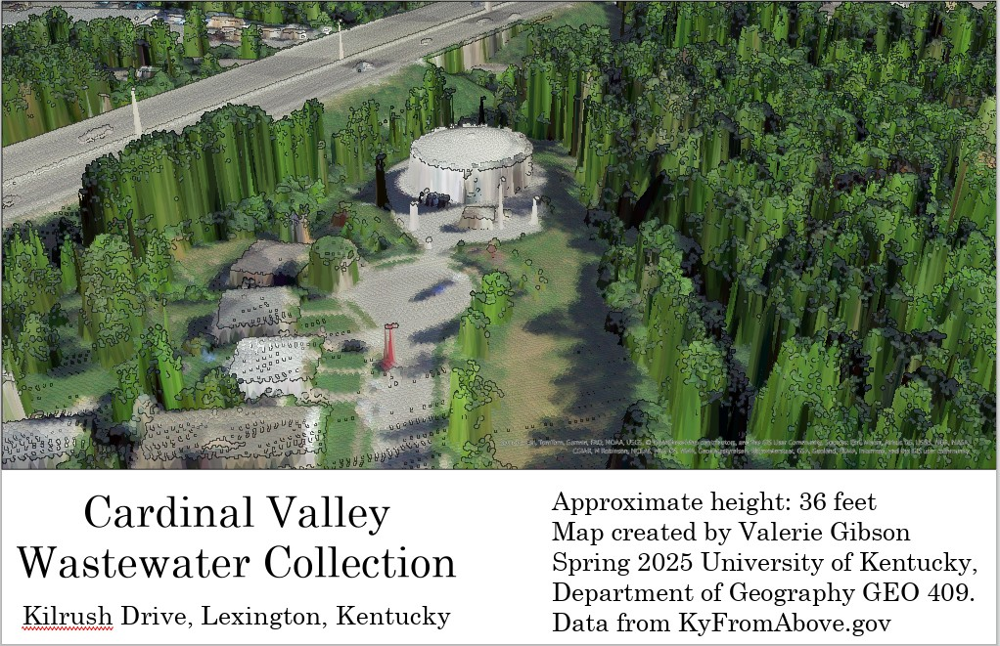
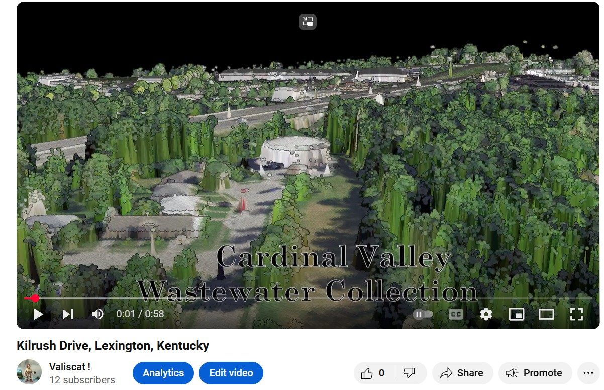

# waste-collection
Cardinal Valley Wastewater Collection Building

* This map and animation was created using LIDAR data from KyFromAbove.gov
* I am not sure what this building is, located next to the wolf run creek on Kilrush drive; however, I beleive it is a sewage collection building. 

  
_Bird's eye view of the sewage collection building_

  
_[Animation Video](https://youtu.be/ooE3L0TlDsk)_